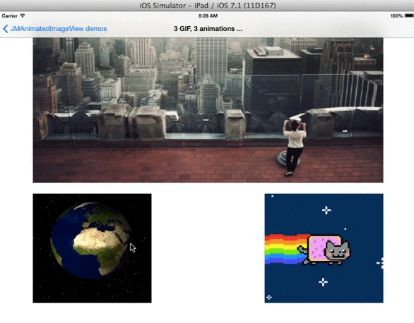

JMAnimatedImageView 
==================

JMAnimatedImageView is a performant subclass of UIImageView:

- Plays huge image animation using a minimum memory pressure,
- Allows manual interactions with imageView to drive manualy animations,
- Can use has a Carousel, 
- GIF are supported to load your animations.

## Installation & Usage

Simply replace your `UIImageView` instances with instances of `JMAnimatedImageView`.

If using CocoaPods, the quickest way to try it out is to type this on the command line:

```shell
$ pod try JMAnimatedImageView
```

In your code, `#import "JMAnimatedImageView.h"` and `#import "JMAnimatedImageView.h"` 

```objective-c
//GIF example
@property (weak, nonatomic) IBOutlet JMAnimatedImageView *jmImageView;

NSURL *url = [[NSBundle mainBundle] URLForResource:@"rock" withExtension:@"gif"];
NSData *data = [NSData dataWithContentsOfURL:url];
[self.jmImageView reloadAnimationImagesFromGifData:data];
[self.jmImageView startAnimating];
```

```objective-c
//PNG example with manual animation
@property (weak, nonatomic) IBOutlet JMAnimatedImageView *jmImageView;

self.jmImageView.animationDelegate = self;
self.jmImageView.animationDatasource = self;
[self.jmImageView reloadAnimationImages]; //<JMOImageViewAnimationDatasource>
self.jmImageView.animationType = JMAnimatedImageViewAnimationTypeAutomaticLinearWithoutAnimation;
self.jmImageView.memoryManagementOption = JMAnimatedImageViewMemoryLoadImageLowMemoryUsage;
```


Some parameters : 

* AnimationType
```objc
typedef NS_ENUM(NSUInteger, JMAnimatedImageViewAnimationType) {
    //Animation is done by a gesture
    JMAnimatedImageViewAnimationTypeInteractive = 0,
    
    //Animation, carousel effect
    JMAnimatedImageViewAnimationTypeManualSwipe, 
    
    //Automatic rotation, use animationDuration + animationRepeatCount
    JMAnimatedImageViewAnimationTypeAutomaticLinear,    
    JMAnimatedImageViewAnimationTypeAutomaticLinearWithoutAnimation,
    JMAnimatedImageViewAnimationTypeAutomaticReverse,
};
```

* MemoryOption
```objc
typedef NS_ENUM(NSUInteger, JMAnimatedImageViewMemoryOption) {
    //images memory will be retain by system
    JMAnimatedImageViewMemoryLoadImageSystemCache = 0, 
    
    //image are loaded in live
    JMAnimatedImageViewMemoryLoadImageLowMemoryUsage,
    
    //you load your images has you want
    JMAnimatedImageViewMemoryLoadImageCustom
};
```

* ImageViewOrder

```objc
typedef NS_ENUM(NSUInteger, JMAnimatedImageViewOrder) {
    JMAnimatedImageViewOrderNone = 0,
    JMAnimatedImageViewOrderNormal = 1,
    JMAnimatedImageViewOrderReverse = -1
};
```

## Multi Gif and animation type (top interactive, leff automatic swipe effect, right automatic without animation)



##  JMimageView can generate Carousels


##  JMimageView allows interactive animations


