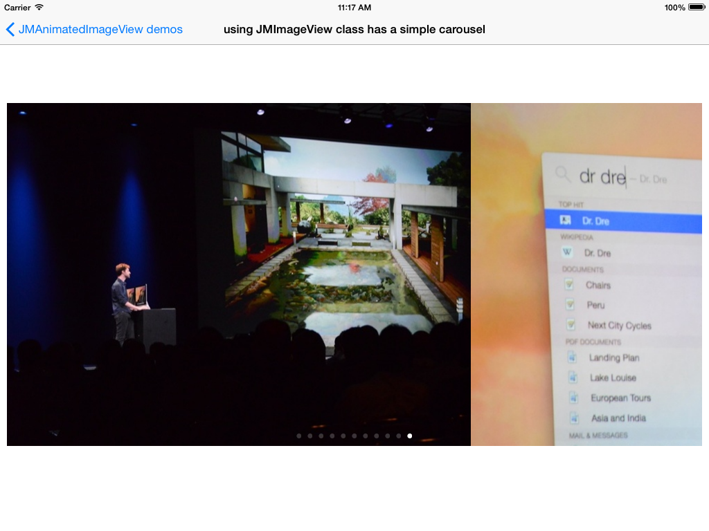
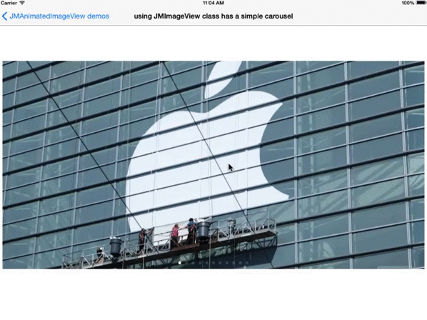
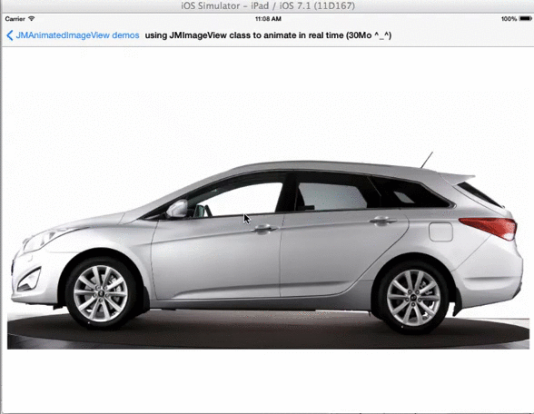

JMAnimatedImageView 
==================

Subclass of UIImageView to drive easy animations.

Some parameters : 

* AnimationType
```objc
typedef NS_ENUM(NSUInteger, JMAnimatedImageViewAnimationType) {
    //Animation is done by a Pan gesture
    JMAnimatedImageViewAnimationTypeManualRealTime = 0,
    
    //Animation, carousel effect
    JMAnimatedImageViewAnimationTypeManualSwipe, 
    
    //Automatic rotation, use animationDuration + animationRepeatCount
    JMAnimatedImageViewAnimationTypeAutomaticLinear,    
    JMAnimatedImageViewAnimationTypeAutomaticReverse,
};
```

* MemoryOption
```objc
typedef NS_ENUM(NSUInteger, JMAnimatedImageViewMemoryOption) {
    //images memory will be retain by system
    JMAnimatedImageViewMemoryLoadImageSystemCache = 0, 
    
    //image are loaded in live
    JMAnimatedImageViewMemoryLoadImageLowMemoryUsage,
    
    //you load your images
    JMAnimatedImageViewMemoryLoadImageCustom
};
```

* ImageViewOrder

```objc
typedef NS_ENUM(NSUInteger, JMAnimatedImageViewOrder) {
    JMAnimatedImageViewOrderNone = 0,
    JMAnimatedImageViewOrderNormal = 1,
    JMAnimatedImageViewOrderReverse = -1
};
```







